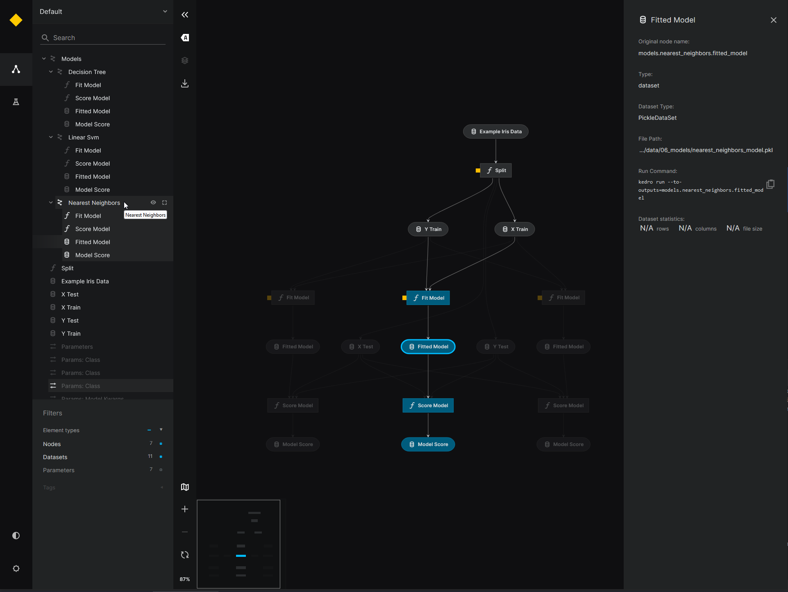

[](https://kedro.org/)

# kedro-dynamic-pipeline-hook-example

Run the example as follows,
```bash
pip install ./src/
kedro run
```


A possible implementation of Dynamic kedro pipelines using a `after_catalog_created` hook. Shared as input to
https://github.com/kedro-org/kedro/issues/2627 

The idea is that if you can access the `DataCatalog` in the `create_pipeline(**kwargs)` method, then you can
create dynamic pipelines from your parameters and data catalog. To do this,

1. Create a `after_catalog_created` hook
2. Replace the `register_pipelines()` function with a custom `register_dynamic_pipelines(catalog: DataCatalog)` method
3. Use `create_pipeline(catalog: DataCatalog)` functions to create your pipelines !

In this example repository, we take the `pandas-iris` starter and dynamically create pipelines to train and score
models. The models we want to train and score are listed in the `parameters.yml`. When we make changes to the set of 
models in the `parameters.yml`, then the pipeline changes.

As a bonus, because dynamically creating pipelines also involves creating dynamic `DataCatalog` entries, we can
leverage the recent Data Factories to match datasets. Specifically, we can use dynamic namespaces for pipelines
and also use these namespaces to match catalog entries. 

## Kedro-viz output

The dynamic pipeline and the catalog using data factories is compatible with kedro-viz. The pipeline looks like this,


When fully expanded, we can highlight dynamic datasets and confirm that they are matched to entries in our
`DataCatalog`. 



# About implementation

You can dive through the code. The first commit in this repository is the default `kedro new --starter pandas-iris` 
output. The second commit contains most of the changes compared to the default new project, use that to inspect
the changes to make this example work.

Here I'll briefly describe the changes required and how they work together.

## Hook

The main Hook will replace the `register_pipelines()` method, after the catalog is created. 

```python
class ProjectHooks:
    @hook_impl
    def after_context_created(self, context: KedroContext) -> None:
        context.catalog

    @hook_impl
    def after_catalog_created(self, catalog: DataCatalog, conf_catalog) -> None:
        """Hook to fill in and extend templated pipelines."""
        pipeline_registry.register_pipelines = pipeline_registry.register_dynamic_pipelines(catalog)
        pipelines.configure("kedro_dynamic_pipeline_hook_example.pipeline_registry")

```

## Creating pipelines

Using this hook, we can create pipelines that have access to the `DataCatalog`! An example outline can look like below.

The full example you can find at [./src/kedro_dynamic_pipeline_hook_example/pipeline.py](./src/kedro_dynamic_pipeline_hook_example/pipeline.py)

```python

def create_namespaced_pipeline(catalog: DataCatalog) -> Pipeline:
    """Create model fit + score pipelines for all models listed under params:models.
    ```

    Where model_name.class should be an importable python location.
    """
    parameters = catalog.datasets.parameters.load()  # access parameters from catalog
    models = parameters["models"]  # a dictionary with the keys being the model labels
    
    # Create re-usable pipeline
    base_pipe = pipeline(
        [
            node(func=fit_model, ...),
            node(func=score_model, ...)
        ]
    )
    
    ...
        
    # create namespaced pipeline for each model | adds a '{model}' prefix to inputs and outputs
    namespaced_pipelines = [
        pipeline(
            pipe=base_pipe,
            namespace=model,
            inputs=static_inputs
        )
        for model in models.keys()
    ]
    
    ...

```

## Parameters

In the `parameters` we provide a set of models we want to test, example below. To experiment with other models, all
you need to change is the `parameters.yml` and from that the catalog and pipelines are created automatically.

```yaml
# parameters.yml
models:
  nearest_neighbors:
    class: sklearn.neighbors.KNeighborsClassifier
    model_kwargs:
      n_neighbors: 3
  linear_svm:
    class: sklearn.svm.SVC
    model_kwargs:
      kernel: linear
      C: 0.025
  decision_tree:
    class: sklearn.tree.DecisionTreeClassifier
    model_kwargs:
      max_depth: 3
#  neural_net:  # uncomment to add another pipeline for this model
#    class: sklearn.neural_network.MLPClassifier
#    model_kwargs:
#      alpha: 1
#      max_iter: 300

```

## Data Catalog

In the `catalog.yml` we make use of the recently added Data Factories! Most like this example,
https://docs.kedro.org/en/stable/data/data_catalog.html#example-3-generalise-datasets-using-namespaces-into-one-dataset-factory

In this example, our datasets have 2 nested namespaces. One example is `models` -> `linear_svm` which adds
a `models.linear_svm` to all pipeline inputs/outputs. We can create data factories to match all the datasets 
automatically in the `models` namespace:

```yaml
models.{namespace}.fitted_model:
  type: pickle.PickleDataSet
  filepath: data/06_models/{namespace}_model.pkl

models.{namespace}.model_score:
  type: json.JSONDataSet
  filepath: data/06_models/{namespace}_model_score.json
```

The output of running the pipeline gives you the following files,

```bash
.\data\06_models


      LastWriteTime         Length Name
      -------------         ------ ----
24-8-2023     14:51              0 .gitkeep
24-8-2023     15:50           2043 decision_tree_model.pkl
24-8-2023     15:50              3 decision_tree_model_score.json
24-8-2023     15:50           5728 linear_svm_model.pkl
24-8-2023     15:50             18 linear_svm_model_score.json
24-8-2023     15:50           7322 nearest_neighbors_model.pkl
24-8-2023     15:50             18 nearest_neighbors_model_score.json
24-8-2023     15:28          29735 neural_net_model.pkl
24-8-2023     15:28              3 neural_net_model_score.json
```

## Overview

This is your new Kedro project, which was generated using `Kedro 0.18.12`.

Take a look at the [Kedro documentation](https://kedro.readthedocs.io) to get started.
